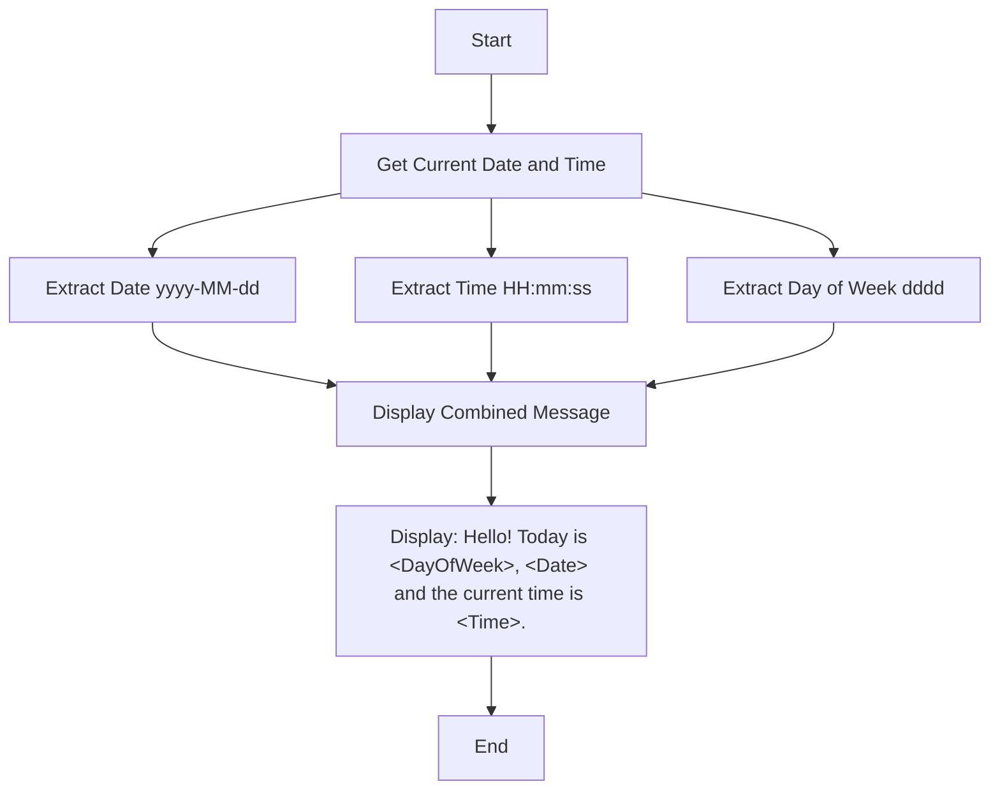

```mermaid
graph TD
    A[Start] --> B[Get Current Date and Time]
    B --> C[Extract Date yyyy-MM-dd]
    B --> D[Extract Time HH:mm:ss]
    B --> E[Extract Day of Week dddd]
    C --> F[Display Combined Message]
    D --> F
    E --> F
    F --> G["Display: Hello! Today is &lt;DayOfWeek&gt;, &lt;Date&gt; and the current time is &lt;Time&gt;."]
    G --> H[End]
```