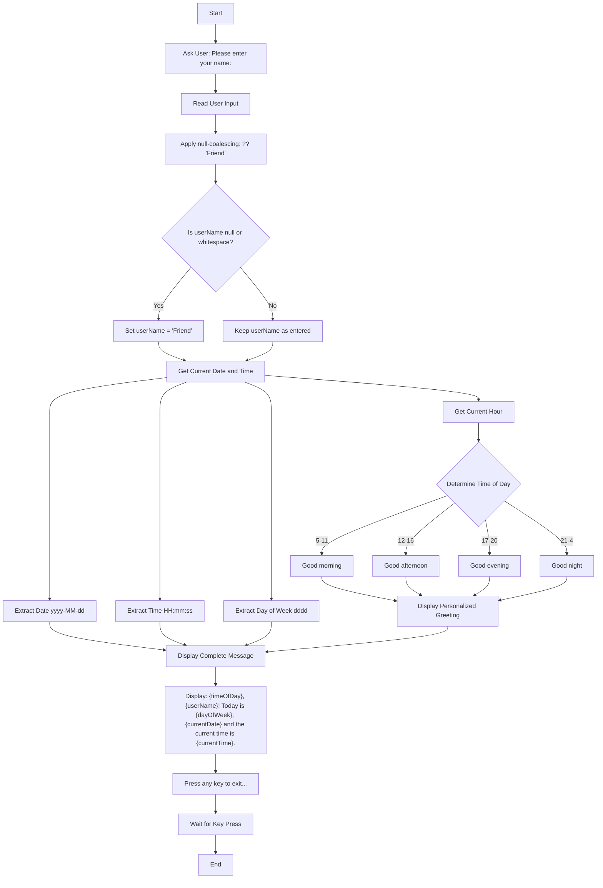

```mermaid
graph TD
    A[Start] --> B["Ask User: Please enter your name:"]
    B --> C[Read User Input]
    C --> D["Apply null-coalescing: ?? 'Friend'"]
    D --> E{Is userName null or whitespace?}
    E -- Yes --> F["Set userName = 'Friend'"]
    E -- No --> G[Keep userName as entered]
    F --> H[Get Current Date and Time]
    G --> H
    H --> I[Extract Date yyyy-MM-dd]
    H --> J[Extract Time HH:mm:ss] 
    H --> K[Extract Day of Week dddd]
    H --> L[Get Current Hour]
    L --> M{Determine Time of Day}
    M -- "5-11" --> N["Good morning"]
    M -- "12-16" --> O["Good afternoon"]
    M -- "17-20" --> P["Good evening"]
    M -- "21-4" --> Q["Good night"]
    N --> R[Display Personalized Greeting]
    O --> R
    P --> R
    Q --> R
    I --> S[Display Complete Message]
    J --> S
    K --> S
    R --> S
    S --> T["Display: {timeOfDay}, {userName}! Today is {dayOfWeek}, {currentDate} and the current time is {currentTime}."]
    T --> U["Press any key to exit..."]
    U --> V[Wait for Key Press]
    V --> W[End]
```